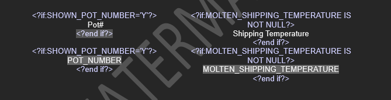
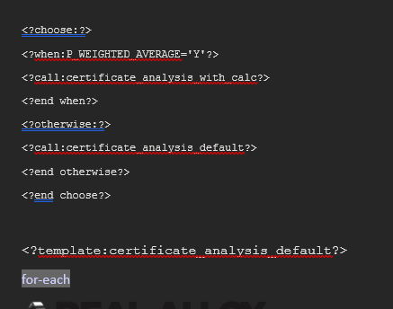
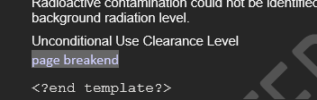

# Estruturas Condicionais

## Condição em linha
É possível adicionar calcular ou exibir informações somente se alguma determinada condição for atingida.
- É possível criar este condicionamento em campos de formulário ou simplesmente colocar o código XML na página.
### Sintaxe
````
<?if:[condicaoBoolean]?>[valor/operacao]<?end if?>
````
**Exemplos:**

````
<?if:BEG_QTY >= 0 and BEG_COST_WT >= 0?><?xdoxslt:set_variable($_XDOCTX, ‘SUM_BEG_VALUE’, xdoxslt:get_variable($_XDOCTX, ‘SUM_BEG_VALUE’) + BEG_QTY*BEG_COST_WT)?><?end if?>
````
## Condição por Layout
Utilizando condição por layout, é possível definir layouts totalmente diferentes de acordo com alguma determinada condição.
1. No inicio da página, deve ser definido as condições para cada layout:
````
<?choose:?>

<?when:[condicaoBoolean]?>

<?call:[nomeLayout]?>

<?end when?>

<?otherwise:?>

<?call:[nomeLayout]?>

<?end otherwise?>

<?end choose?>
````
2. Feito isso, cada layout dentro do mesmo arquivo RTF, deve ser definido o inicio e o fim do layout.
````
<?template:certificate_analysis_default?>
[LAYOUT DESENVOLVIDO]
<?end template?>
````

**Exemplo:**


