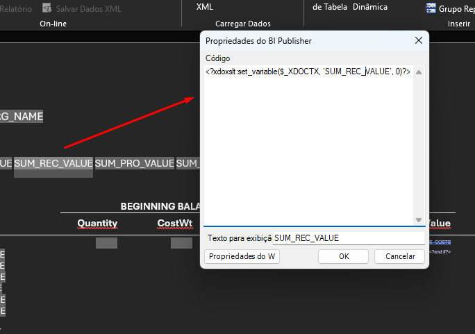

# Variáveis em Nível de Layout
Utilizando variáveis em nível de layout é possível armazenar lógica, valores e até cálculos em no nível mais externo de um BI desenvolvido no BIP (layout).
- Considerar escopo da variável.
## Sintaxe
````
<?xdoxslt:set_variable($_XDOCTX, ‘[nomeVariavel]’, [valor_variavel])?>
````


### Utilizar valor da variável
Para obter o valor que já esta dentro de uma variável já definida é necessário utilizar a seguinte sintaxe.
````
<?xdoxslt:get_variable($_XDOCTX, ‘[nomeVariavel]’)?>
````
### Operações com variáveis
É possível realizar operações utilizando os valores das variáveis, igualmente como uma linguagem de programação.

**Exemplo:**
Neste exemplo estamos realizando um calculo utilizando o valor da variável, e guardando o resultado na mesma variável.
````
<?xdoxslt:set_variable($_XDOCTX, ‘SUM_BEG_VALUE’, xdoxslt:get_variable($_XDOCTX, ‘SUM_BEG_VALUE’) + BEG_QTY*BEG_COST_WT)?>
````
