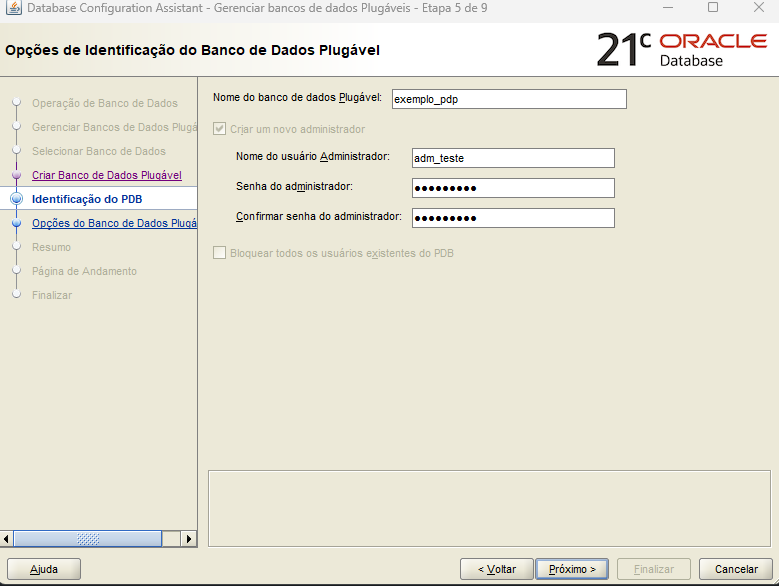

# Banco de Dados Plugável (PDB)
Conceito da arquitetura Multitenant do Oracle.
- PDBs podem ser isolados uns dos outros, mas compartilham a mesma infraestrutura.
- Cada PDB tem seus próprios dados de aplicação, usuários, objetos e schemas.
## Criando um PDB
1. Acessa a interface gráfica de criação de PDP (Assistente de Configuração de Bancos de Dados)
2. Selecione "Gerenciar bancos de dados Plugáveis"

3. Acesse "Criar um banco de dados plugável"
4. Fornecessa o acesso de um usuário DBA.

5. Acesse "Criar um banco de dados Plugável com base em outro PDB"
6. Forneça as informações como nome do PDB e login

7. Finalize a criação do PDB.
---
**[Voltar](criando-componentes.md)**