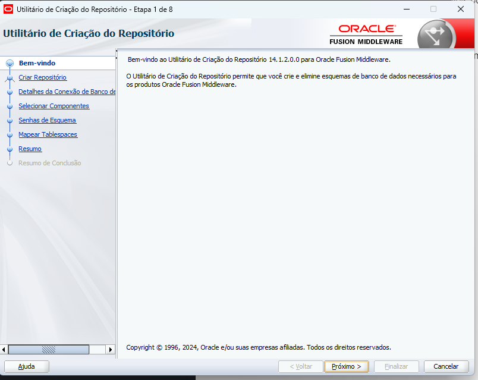
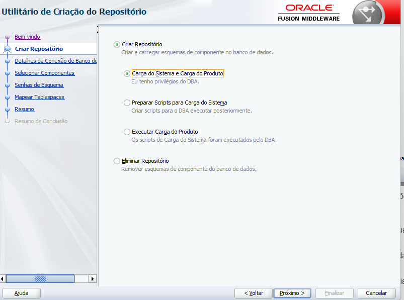
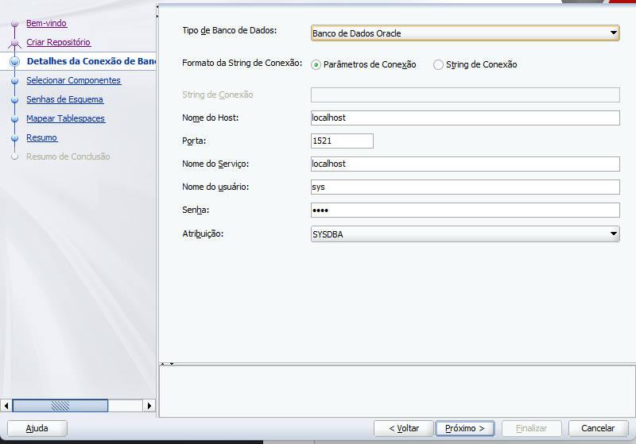
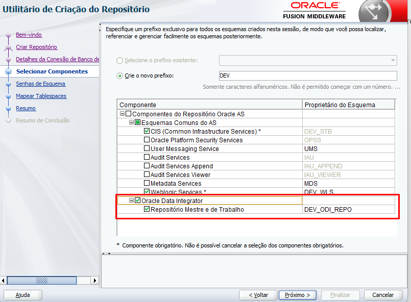
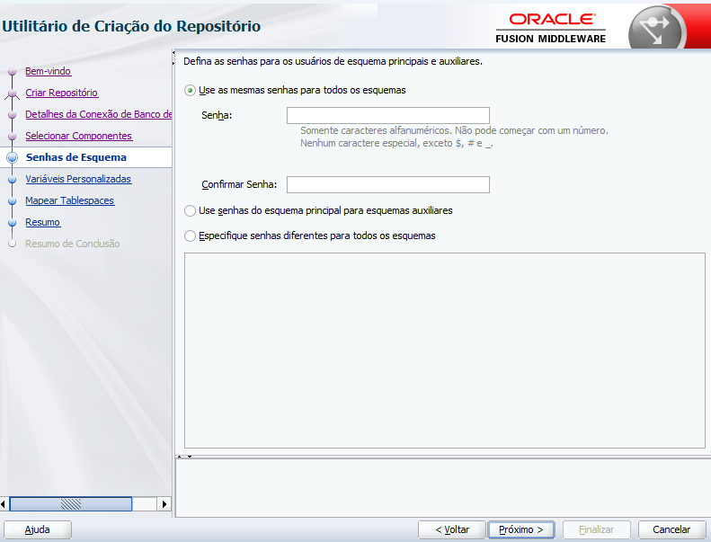
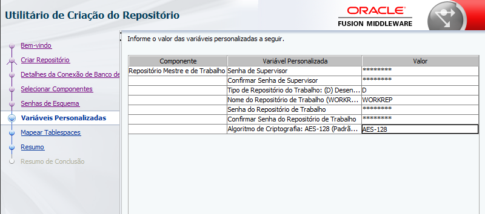
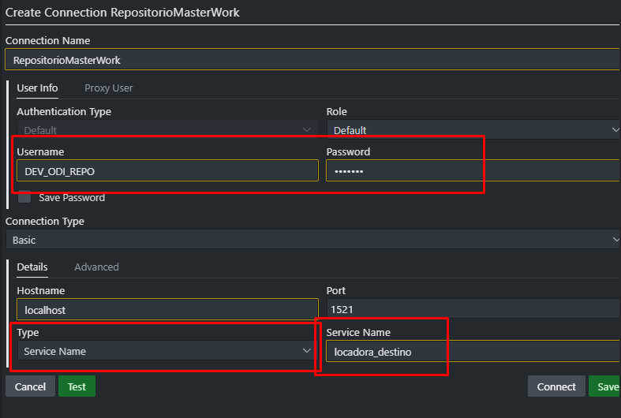

# Criando um Repositório
Repositórios são schemas de banco de dados responsáveis por armazenar metadados das aplicações/pipelines desenvolvidas dentro do ODI.
1. Acessando ferramenta de criação de repositórios
I. Acesse: C:\Oracle\Middleware\Oracle_Home\oracle_common\bin
II. Execute "rcu_internal"

2. Acessando a próxima aba, você possui as seguintes opções:
- Criar Reposítorio
    - **Carga do Sistema e Carga do Produto**, utilizado quando se tem acesso de DBA, permitindo acesso total para criação dos repositórios.
    - **Preparar Scripts para Carga do Sistema**, possibilidade de criar os scripts dos repositórios para o DBA executar posteriormente.
    - **Executar Carga do Produto**, com o repositório já criado pelo DBA, carrega os metadados no repositório.
- Eliminar Repositório.

3. Criando o repositório como DBA:
I. O primeiro passo para criar um reposítorio e definir o banco de dados que será criado o schema(repositório).

II. O próximo passo é criar os componentes do repositório:
- Para um repositório para o ODI, somente precisamos adicionar o componente feito especificamente para repositórios ODI:

III. Agora precisamos definir a senha do repositório/schema

IV. Para a criação do repositórios, precisamos definir o valor de algumas variáveis:
- Senha do Supervisor (usuário para fazer a conexão do repositório com o ODI Studio): definir uma senha
- Confirmar Senha do Supervisor: Confirmação de senha
- Tipo de Repositório: [D] Desenvolvimento ou [E] Execução
- Nome do Repositório de Trabalho: WORKREP
- Senha do Repositório de Trabalho: definir uma senha
- Confirmar Senha do Repositório de Trabalho: Confirmação de senha
- Algoritmo de Criptofrafia: AES-128 ou AES-256

### Testando Repositório
1. Acesse um cliente que possibilite acessar e executar DB SQL (SQL Server, DBeaver, VS Code...)
2. Crie uma nova conexão com o banco passando o nome do serviço do PDB e o usuário sendo o nome do repositório criado.

3. Execute a query "SELECT * FROM USER_TABLES" para visualizar todos as tabelas criadas pelo ODI.
---
**[Voltar](criando-componentes.md)**