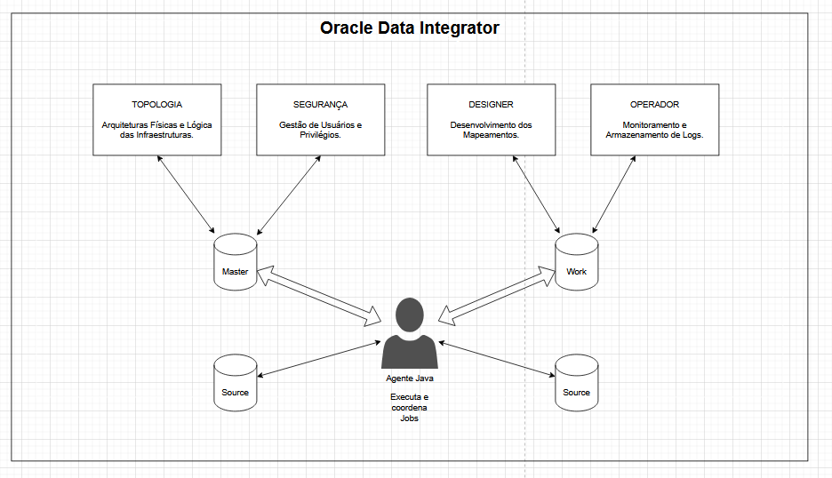

# ODI Studio - Interface de Desenvolvimento
Ferramenta gráfica pra desenvolvimento de pipelines ETL/ELT da Oracle.
## Composição da Ferramenta
A ferramenta é composto por 4 principais módulos/navegadores.
- Topologia (Utilizado para visualizar e manipular a topologia do banco de dados e infraestrutura).
- Segurança (Oferece recurso de controle de segurança, como usuários e permissões).
- Designer (Local para desenvolver os mapeamentos das pipelines).
- Operador (Monitoramento das pipelines e armazenamento de Logs).
