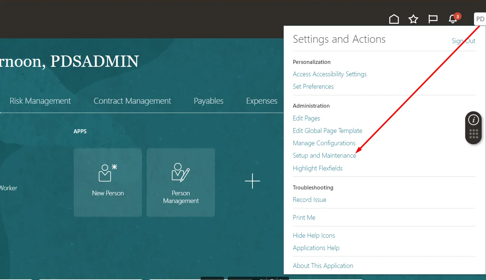
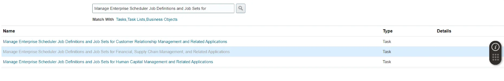
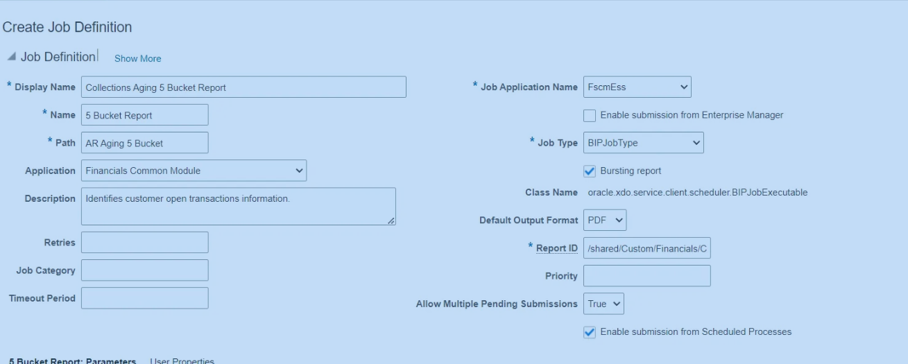

# Criando e Configurando Jobs
1. Dentro da home, acesse "Setup and Maintence"
2. Clique em Tasks>Search e pesquise por: "Manage Enterprise Scheduler Job Definitions and Job Sets for"
3. Selecione a organização do job
4. Clique em "+" para criar um novo Job
5. Preencha o formulário:
	- **Display Name**: Name used by User to search de job scheduled process.
	- **Name**: Name like a ID
	- **Path**: folder name to save the job (normally is used the same name of the task of the report).
	- **Application**: Not required, but it is good to set up, select the type of application is your job (Financial, Supply Chain…)
	- **Description**: Just the job description.
	- **Job Application Name:** Kind of the application, (like query on data set).
	- **Job Type**: Select the job type (Always select Bursting Report too)
	- **Report ID:** Report Path: /Custom…/[Report_Name].xdo
	- **Allow Multiple Pending Submissions:** If your job can be run multiple times in the same time.